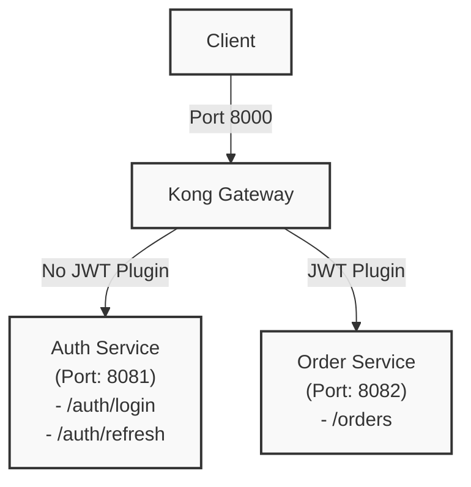

# Kong + Spring Boot

This project is for learning how to use Kong + Spring Boot + Auth.

## Architecture Diagram



## Setup

Generate enviroment vavariable

```bash
echo "JWT_SECRET_ISSUER=http://my-auth-service" >> .env

echo "JWT_SECRET=$(openssl rand -hex 16)" >> .env

echo "JWT_REFRESH_SECRET=$(openssl rand -hex 16)" >> .env
```

## Start Server

```bash
docker compose up -d --build 
```

## Test

```curl
curl -X POST http://localhost:8000/auth/login \
  -H "Content-Type: application/json" \
  -d '{"username": "admin", "password": "password"}'
```

```curl
curl -X POST http://localhost:8000/orders \
  -H "Authorization: Bearer <ACCESS_TOKEN>" \
  -H "Content-Type: application/json" \
  -d '{"product": "Request Product", "quantity": 1}'
```

```curl
curl http://localhost:8000/orders/<orderId> \
  -H "Authorization: Bearer <ACCESS_TOKEN>"
```

```curl
curl -X POST http://localhost:8000/auth/refresh \
  -H "Content-Type: application/json" \
  -d '{"refreshToken": "<REFRESH_TOKEN>"}'
```
